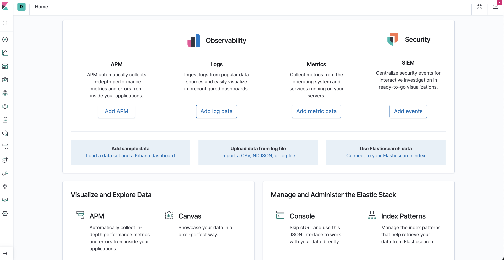

# Elk-Project

This network allows me to access my jump box from my public IP address specified in the network rules. Port 22 is allowed from my public IP specifically so that I can SSH into my jump box. The jump box is used as an administration point so that I can access both of my web servers in addition to my ELK server. There is a peering network setup in Azure to allow the 10.1.0.0/24 and 10.3.0.0/24 to pass traffic. This allows me to access the Elk server via the jump box. I've also enabled web traffic to the ELK server from my public IP for the web interface. 
|Server Name|Server IP|Operating System|
|:----------|---------|----------------|
|Jump Box|10.1.0.4|Linux Ubuntu|
|Web Server1|10.1.0.5|Linux Ubuntu|
|Web Server2|10.1.0.7|Linux Ubuntu|
|Elk VM|10.3.0.5|Linux Ubuntu|

I installed ELK on the server using the following .yaml script 

      name: Configure Elk VM with Docker
      hosts: elk
      remote_user: azureuser
      become: true
      tasks:
    # Use apt module
    - name: Install docker.io
      apt:
        update_cache: yes
        force_apt_get: yes
        name: docker.io
        state: present

      # Use apt module
    - name: Install python3-pip
      apt:
        force_apt_get: yes
        name: python3-pip
        state: present

      # Use pip module (It will default to pip3)
    - name: Install Docker module
      pip:
        name: docker
        state: present

      # Use command module
    - name: Increase virtual memory
      command: sysctl -w vm.max_map_count=262144

      # Use sysctl module
    - name: Use more memory
      sysctl:
        name: vm.max_map_count
        value: “262144”
        state: present
        reload: yes

      # Use docker_container module
    - name: download and launch a docker elk container
      docker_container:
        name: elk
        image: sebp/elk:761
        state: started
        restart_policy: always
        # Please list the ports that ELK runs on
        published_ports:
          -  5601:5601
          -  9200:9200
          -  5044:5044

Once installed I was able to access the Kibana web UI on port 5601. This port was allowed through the ELK security group from my public IP address. 

 
 
 Filebeat and metric beat were installed using the following .yaml scirpts. 
 
 	- name: Installing and Launch Filebeat
	  hosts: webservers
	  become: true
	  tasks:
	    # Use command module
	  - name: Download filebeat deb 
	    apt:
	     deb: https://artifacts.elastic.co/downloads/beats/filebeat/filebeat-7.4.0-amd64.deb
	

	    # Use command module
	  - name: Install filebeat .deb
	    command: dpkg -i filebeat-7.4.0-amd64.deb
	

	    # Use copy module
	  - name: Drop in filebeat.yml
	    copy:
	      src: /etc/ansible/files/filebeat-config.yml
	      dest: /etc/filebeat/filebeat.yml
	

	    # Use command module
	  - name: enable and configure system module
	    command: filebeat modules enable system
	

	    # Use command module
	  - name: Setup filebeat
	    command: filebeat setup
	

	    # Use command module
	  - name: Start filebeat service
	    command: service filebeat start

Metric Beat

	- name: Install metric beat
 	 hosts: webservers
 	 become: true
 	 tasks:
    # Use command module
 	 - name: Download metricbeat
    command: curl -L -O https://artifacts.elastic.co/downloads/beats/metricbeat/metricbeat-7.4.0-amd64.deb

    # Use command module
 	 - name: install metricbeat
    command: dpkg -i metricbeat-7.4.0-amd64.deb

    # Use copy module
 	 - name: drop in metricbeat config
    copy:
      src: /etc/ansible/files/metricbeat-config.yml
      dest: /etc/metricbeat/metricbeat.yml

    # Use command module
 	 - name: enable and configure docker module for metric beat
    command: metricbeat modules enable docker

    # Use command module
	  - name: setup metric beat
    command: metricbeat setup

    # Use command module
	  - name: start metric beat
    command: service metricbeat start


Filebeat collects the log files and events. Metricbeat records metrics and statistical data. 
